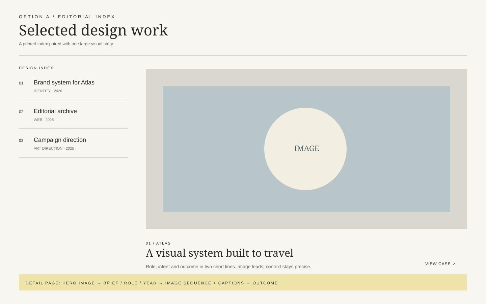
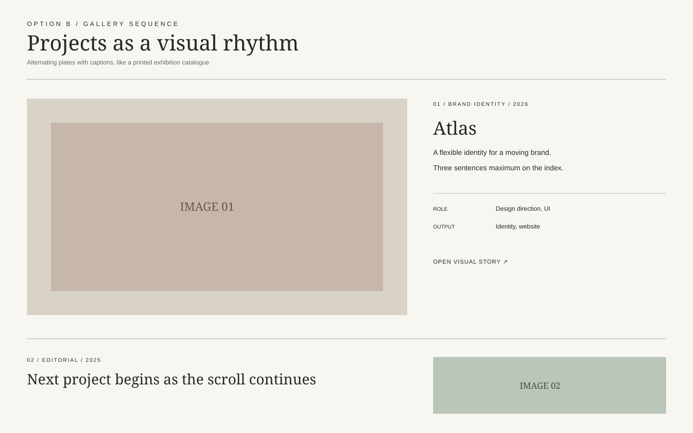
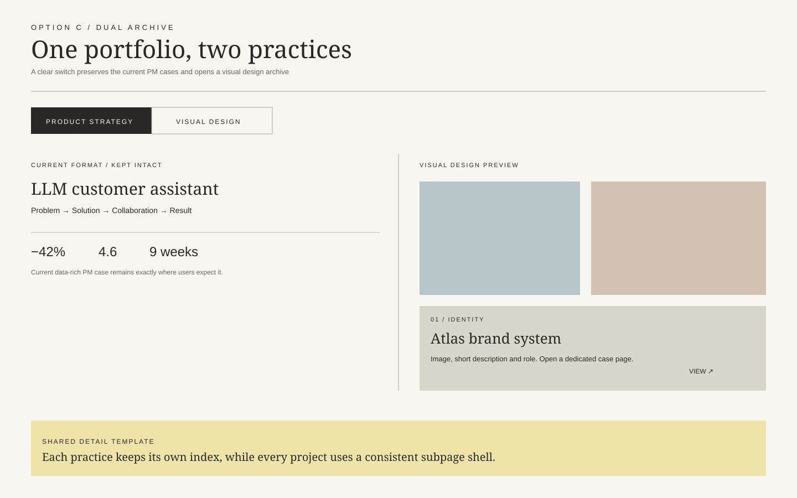

# Project layout expansion options

The existing product-management cases remain intact in every option. The new visual-design format adds image-led summaries and dedicated case-study routes only where a project needs them.

## Option A — Editorial index

- Compact printed index on the left, one dominant image and synopsis on the right.
- Best fit with the current paper/editorial tone.
- Recommended route: `/projects/:slug`.

## Option B — Gallery sequence

- Alternating large images and text plates form a scroll-led visual sequence.
- Strongest visual impact, but long pages need a small, curated project count.
- Recommended route: `/projects/:slug`.

## Option C — Dual archive

- Switches between Product Strategy and Visual Design while preserving the current project format.
- Clearest separation for different audiences and future growth.
- Recommended routes: `/projects/product/:slug` and `/projects/design/:slug`.

## Shared case-study page

Whichever index is selected, the design-project subpage should use the same sequence: title image, brief and role, image sequence with captions, process or rationale, and outcome. Admin-authored line breaks and all current project content remain authoritative.
